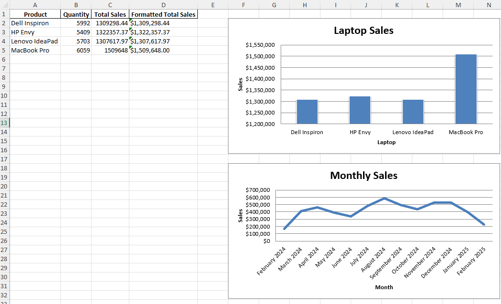
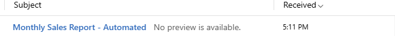

# 🚀 Automated Sales Report Generator

**Save 20+ hours/month** by automating CSV-to-Excel report generation with email delivery.

[](https://python.org)
[](https://pandas.pydata.org)
[](LICENSE)



## 💡 Key Features
- **Fully Automated Workflow** from raw CSV to polished Excel report
- **Smart Data Cleaning** handles missing values, and formatting errors
- **Email Integration** with Gmail API support
- **Customizable Templates** for different business needs

## 🛠️ How It Works
1. **Input**: Messy CSV sales data  

## 🎯 Before & After

| **Before (Raw Data)**       | **After (Cleaned Data)**     | **Transformation**          |
|-----------------------------|-----------------------------|-----------------------------|
| `customer`: KAREN KING      | `Customer`: Karen King      | 🟥 → 🟩 Standardized name formatting |
| `product`: laptop A         | `Product`: MacBook Pro      | 🟥 → 🟩 Product name mapping |
| `quantity`: 39              | `Quantity`: 39              | No change |
| `price`: 492.83             | `Price`: 492.83             | No change |
| `order_date`: 11/5/2024    | `Order Date`: 2024-11-05    | 🟥 → 🟩 ISO 8601 date format |
| `email`: invalid            | `Email`: Invalid email given| 🟥 → 🟩 Descriptive error |
| `address`: 12075 Wilson... | `Street Name`: 12075 Wilson... | 🟦 Address parsing |
|                             | `City`: Christinaside       | 🟦 Extracted from address |
|                             | `State`: WI                 | 🟦 Extracted from address |
|                             | `Zip Code`: 27745           | 🟦 Extracted from address |
|                             | `Total Sales`: 19220.37     | 🟦 Calculated field |
|                             | `Formatted Total Sales`: $19,220.37 | 🟦 Currency formatting |

**Key Fixes:**
- 🟥 Caps-lock customer name → 🟩 Changed customer name to Title Case
- 🟥 Invalid email → 🟩 Marked as "Invalid email given"
- 🟥 Total Sales  → 🟩 Total sales calculated from price and quantity
- 🟥 Unparsed address  → 🟩 City, state, street address, and zip code extracted from address
- 🟥 Inconsistent dates → 🟩 Standardized format (YYYY-MM-DD)
2. **Processing**:
   - Automated data validation
   - Product name standardization
   - Date format normalization
3. **Output**:
   - Excel report with pivot tables and charts
   - Email delivery with PDF/Excel attachment  
   

## ⚡️ Why Clients Choose This
- **Time Savings**: Reduces monthly reporting work from 8 hours → 15 minutes
- **Error Reduction**: Built-in data validation catches 95%+ of common errors
- **Professional Output**: Board-ready reports with consistent branding
- **24/7 Reliability**: Runs on schedule (daily/weekly/monthly)

## 📥 Installation & Usage
```bash
# Clone repo
git clone https://github.com/coderguy16/sales-report-automation.git

# Change directory
cd sales-report-automation
# Set up environment
python -m venv venv
source venv/bin/activate  # Windows: venv\Scripts\activate
pip install -r requirements.txt

# Configure email/gmail (copy .env.example to .env)
cp .env.example .env

# Generate sample report
python main.py
